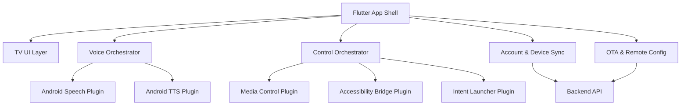
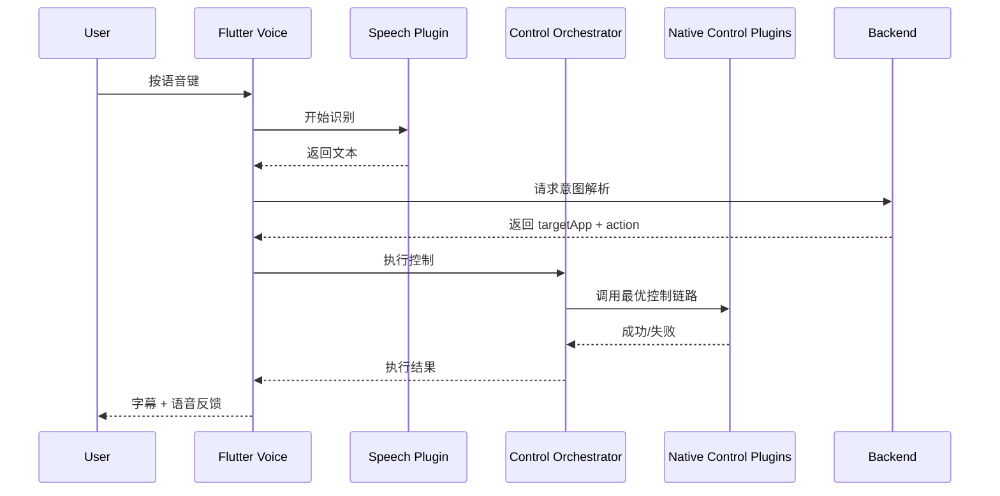

# OpenClaw Android / Android TV Client Architecture

## 1. 文档信息

- 文档名称：Android 客户端技术设计
- 版本：v0.1
- 日期：2026-03-19
- 关联 PRD：[openclaw-android-tv-prd](C:\Users\soulzyn\Desktop\codex\docs\product\2026-03-19-openclaw-android-tv-prd.md)
- 关联兼容矩阵：[android-tv-compatibility-matrix](C:\Users\soulzyn\Desktop\codex\docs\testing\2026-03-19-android-tv-compatibility-matrix.md)

## 2. 设计目标

为 OpenClaw Android / Android TV 客户端定义一套适用于低版本 Android 与 Android TV 的技术架构，重点解决以下问题：

- TV 场景的主界面与遥控器交互
- 多语言语音输入与语音播报
- 对目标 App 的统一控制执行
- 设备授权、订阅同步与 OTA 配置
- 低版本系统、无 GMS、厂商 ROM 下的兼容与降级

## 3. 设计原则

- Flutter 负责跨端 UI 和业务编排
- Android 原生层负责系统能力与高兼容性控制
- 所有高风险能力都做探测、降级、日志采集
- 控制链路优先使用低权限、高稳定性方案
- 不把上游模型密钥放在客户端

## 4. 总体架构



## 5. 模块划分

## 5.1 Flutter 模块

### `app_shell`

职责：

- 应用启动
- 路由管理
- 全局状态初始化
- 主题与 TV 布局适配

### `tv_home`

职责：

- 首页布局
- 虚拟形象展示
- 大字字幕层
- 语音交互主入口
- 遥控器焦点处理

### `voice`

职责：

- 录音触发
- 语音识别状态管理
- 多语言设置
- TTS 播放控制
- 识别失败与超时提示

### `control`

职责：

- 接收意图解析结果
- 选择目标 App 的 `ControlProfile`
- 调用原生插件执行控制动作
- 处理失败回退和用户提示

### `account`

职责：

- 登录
- 会话状态
- 订阅状态展示
- Token 余额
- 支付页入口

### `device_sync`

职责：

- 设备注册
- 设备列表同步
- 共享限制提示
- 心跳上报

### `settings`

职责：

- 语言设置
- 角色设置
- 权限状态
- 版本信息
- 远程配置状态

## 5.2 Android 原生插件模块

### `speech_plugin`

职责：

- 封装 `SpeechRecognizer` 或厂商语音能力
- 返回识别结果与错误码
- 提供语言能力探测

### `tts_plugin`

职责：

- 封装 `TextToSpeech`
- 提供音色、语速、语言切换
- 提供 TTS 可用性探测

### `intent_launcher_plugin`

职责：

- 通过包名、Intent、Deep Link 启动目标 App
- 判断 App 是否安装

### `media_control_plugin`

职责：

- 尝试通过 `MediaSession`、`AudioManager`、媒体按键控制目标 App
- 提供播放、暂停、下一首、上一首、快进、快退等统一接口

### `accessibility_bridge_plugin`

职责：

- 执行方向键导航、返回、确认
- 在必要时读取前台节点信息
- 对特定 App 做兜底适配

### `device_capability_plugin`

职责：

- 探测系统版本
- 探测 GMS 状态
- 探测可用语言包
- 探测遥控器/输入方式

### `ota_plugin`

职责：

- 获取当前版本
- 检查远程升级信息
- 启动安装流程或展示升级提示

## 6. 关键数据结构

## 6.1 `ControlProfile`

用于定义每个目标 App 的控制策略。

建议字段：

- `appId`
- `displayName`
- `packageNames`
- `launchIntent`
- `supportedActions`
- `fallbackActions`
- `requiresAccessibility`
- `requiresMediaSession`
- `deviceWhitelist`
- `deviceBlacklist`
- `notes`

## 6.2 `VoiceSession`

建议字段：

- `sessionId`
- `languageCode`
- `startTime`
- `recognizedText`
- `intentType`
- `targetApp`
- `action`
- `executionResult`
- `errorCode`

## 6.3 `DeviceCapabilitySnapshot`

建议字段：

- `androidVersion`
- `isAndroidTv`
- `hasGms`
- `speechAvailable`
- `ttsAvailable`
- `accessibilityEnabled`
- `foregroundServiceAllowed`
- `supportedLanguages`

## 7. 核心流程设计

## 7.1 启动流程

1. `app_shell` 启动
2. 读取本地缓存配置
3. 调用 `device_capability_plugin` 探测系统能力
4. 拉取远程配置和账户状态
5. 根据设备能力设置功能开关
6. 进入 `tv_home`

## 7.2 语音控制流程



## 7.3 控制执行流程

执行顺序建议：

1. 查找目标 App 的 `ControlProfile`
2. 判断目标 App 是否安装
3. 按优先级尝试：
   - `Intent / Deep Link`
   - `MediaSession`
   - `KeyEvent`
   - `Accessibility`
4. 若执行成功，返回统一结果
5. 若执行失败，记录日志并触发回退链路
6. 若全部失败，给用户明确字幕提示

## 7.4 OTA 流程

1. 客户端启动或定时轮询
2. 拉取版本元数据与灰度规则
3. 判断当前设备是否命中
4. 若命中，展示更新提示
5. 用户选择更新
6. 进入安装流程

## 8. 兼容性设计

## 8.1 Android 版本兼容

- Android 7/8：保守使用系统 API，减少依赖新特性
- Android 9/10：作为主要优化对象
- Android TV 与手机版共用 Flutter 层，但 TV 单独布局与焦点规则

## 8.2 GMS / 非 GMS 兼容

- 有 GMS：优先尝试系统语音能力
- 无 GMS：优先云端 ASR/TTS 兜底
- 所有设备启动时都要做能力探测，不做硬编码假设

## 8.3 权限与降级

- 未开启录音权限：
  - 不允许语音输入
  - 仍允许遥控器控制与设置浏览
- 未开启 Accessibility：
  - 不影响大多数 L1/L2
  - 关闭复杂兜底动作
- 媒体会话不可用：
  - 回退为按键事件

## 9. 远程配置与开关

客户端必须支持远程配置，避免通过发版调整所有策略。

建议下发项：

- 目标 App 开关
- 各 App 支持动作开关
- 语言开关
- 强制使用云端 ASR/TTS 开关
- Accessibility 兜底开关
- 角色资源下载策略

## 10. 日志与可观测性

### 必须记录的日志

- 启动日志
- 权限状态日志
- 语音识别日志
- 控制执行日志
- 回退链路日志
- OTA 检查日志

### 单次控制建议记录

- 设备型号
- Android 版本
- App 名称
- 动作名称
- 执行链路
- 成功/失败
- 错误码
- 耗时

## 11. 包结构建议

建议目录结构：

```text
lib/
  app_shell/
  core/
  features/
    tv_home/
    voice/
    control/
    account/
    device_sync/
    settings/
  shared/
android/
  app/src/main/kotlin/.../plugins/
```

其中：

- `core` 放网络、存储、日志、配置、能力探测
- `features` 按功能拆分
- 原生插件统一放到 `plugins/`

## 12. 风险与决策建议

### 风险 1: Flutter TV 焦点体验不佳

- 缓解：
  - 首页尽量简单
  - 自定义焦点管理
  - 关键交互少层级

### 风险 2: 原生插件过多导致维护复杂

- 缓解：
  - 统一插件接口规范
  - 每个插件只做单一职责

### 风险 3: 云端依赖过高影响控制延迟

- 缓解：
  - 常见控制命令做本地规则匹配
  - 复杂意图再走云端解析

## 13. 实施建议

### 第一阶段先实现

- `tv_home`
- `voice`
- `control`
- `device_capability_plugin`
- `intent_launcher_plugin`
- `media_control_plugin`

### 第二阶段补充

- `accessibility_bridge_plugin`
- `ota_plugin`
- 更完整的订阅与设备同步

### 第三阶段优化

- 本地规则引擎
- 更细的日志埋点
- 角色资源热更新

## 14. 下一步输出建议

本设计确认后，建议继续补：

- 后端技术架构
- `ControlProfile` 接口定义
- 控制执行引擎时序与错误码规范
