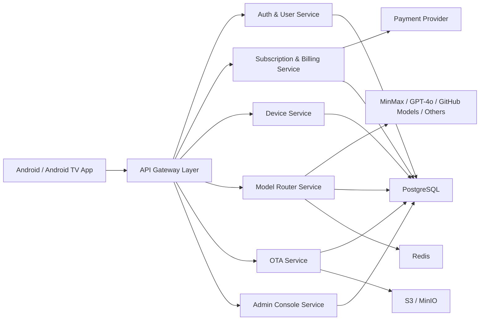

# OpenClaw Android / Android TV Backend Architecture

## 1. 文档信息

- 文档名称：后端技术架构
- 版本：v0.1
- 日期：2026-03-19
- 关联 PRD：[openclaw-android-tv-prd](C:\Users\soulzyn\Desktop\codex\docs\product\2026-03-19-openclaw-android-tv-prd.md)
- 关联客户端设计：[android-client-architecture](C:\Users\soulzyn\Desktop\codex\docs\architecture\2026-03-19-android-client-architecture.md)

## 2. 设计目标

后端系统用于支撑 Android / Android TV 客户端的账户体系、订阅计费、设备绑定、多设备共享、模型路由、OTA 灰度和运营财务后台。

设计目标：

- 支持一个账号多设备共享
- 支持多模型供应商统一接入与成本控制
- 支持订阅、充值、账本与支付回调
- 支持低风险的 OTA 分批发布
- 支持日志审计与基础风控

## 3. 总体设计原则

- MVP 阶段优先采用“模块化单体 + 清晰领域边界”
- 所有外部模型、支付、OTA 分发都通过统一服务层，不让客户端直接访问上游密钥
- 审计优先，所有计费和模型调用必须留痕
- 高风险能力通过策略和配置下发，而不是硬编码
- 先满足单区域部署，保留未来多区域扩展

## 4. 推荐技术栈

- API 框架：`NestJS`
- 数据库：`PostgreSQL`
- 缓存与队列：`Redis`
- 对象存储：`S3 / MinIO`
- 异步任务：`BullMQ` 或同类队列
- 管理后台：`React Admin / Next.js Admin`
- 支付：`Stripe`，稳定币支付适配预留
- 日志与监控：结构化日志 + 指标监控 + 错误告警

## 5. 总体架构

## 6. 服务边界

## 6.1 Auth & User Service

职责：

- 注册、登录、令牌签发
- 用户资料管理
- 会话管理
- 权限角色管理

输出能力：

- 用户身份校验
- 管理端 RBAC
- 客户端短期访问令牌

## 6.2 Subscription & Billing Service

职责：

- 套餐管理
- 订单创建
- 支付回调
- Token 余额变更
- 账单与账本

输出能力：

- 当前订阅状态
- 可用设备上限
- Token 余额
- 充值记录

## 6.3 Device Service

职责：

- 设备注册
- 设备绑定/解绑
- 设备分组
- 共享限制
- 心跳与在线状态

输出能力：

- 当前账号设备列表
- 设备在线状态
- 设备能力快照
- 共享风控状态

## 6.4 Model Router Service

职责：

- 意图解析请求转发
- 多模型供应商统一调用
- 路由策略与回退
- 成本计量
- API 池租约管理

输出能力：

- 统一模型调用接口
- 模型调用日志
- 成本统计
- 路由策略配置

## 6.5 OTA Service

职责：

- 版本元数据管理
- 灰度规则管理
- 设备命中判断
- 发布、暂停、回滚

输出能力：

- 客户端版本检查接口
- 发布任务状态
- 区域/时间/分组灰度

## 6.6 Admin Console Service

职责：

- 运营后台 API
- 财务面板 API
- 设备概览 API
- 版本发布管理 API

输出能力：

- 设备监控
- 收入和成本概览
- 版本发布与回滚
- 模型供应商统计

## 7. 模块化单体建议

MVP 建议在一个代码仓库中实现为模块化单体，而不是一开始拆成多微服务。

推荐模块：

- `auth`
- `user`
- `billing`
- `wallet`
- `device`
- `model-router`
- `ota`
- `admin`
- `audit`
- `risk-control`

原因：

- 早期团队小，运维复杂度要低
- 各模块边界清晰，后续可按压力独立拆分
- 账务、设备、路由之间耦合较高，过早拆分会拖慢迭代

## 8. 核心数据模型

## 8.1 用户与身份

### `users`

- `id`
- `email`
- `phone`
- `display_name`
- `status`
- `locale`
- `created_at`

### `user_roles`

- `user_id`
- `role`

## 8.2 订阅与账务

### `subscription_plans`

- `id`
- `name`
- `billing_cycle`
- `device_limit`
- `included_tokens`
- `status`

### `subscriptions`

- `id`
- `user_id`
- `plan_id`
- `status`
- `current_period_start`
- `current_period_end`

### `payment_orders`

- `id`
- `user_id`
- `order_type`
- `amount`
- `currency`
- `provider`
- `provider_order_id`
- `status`

### `wallet_accounts`

- `id`
- `user_id`
- `token_balance`
- `updated_at`

### `token_ledger`

- `id`
- `user_id`
- `delta`
- `reason`
- `source_type`
- `source_id`
- `created_at`

## 8.3 设备与共享

### `devices`

- `id`
- `user_id`
- `device_uuid`
- `device_name`
- `platform`
- `android_version`
- `rom_vendor`
- `is_android_tv`
- `status`
- `last_seen_at`

### `device_bindings`

- `id`
- `user_id`
- `device_id`
- `binding_status`
- `bound_at`
- `unbound_at`

### `device_capability_snapshots`

- `id`
- `device_id`
- `has_gms`
- `speech_available`
- `tts_available`
- `accessibility_enabled`
- `supported_languages`
- `reported_at`

## 8.4 模型路由

### `model_providers`

- `id`
- `provider_name`
- `status`
- `pricing_model`
- `region_scope`

### `provider_key_pools`

- `id`
- `provider_id`
- `pool_name`
- `quota_type`
- `lease_strategy`
- `status`

### `model_usage_logs`

- `id`
- `user_id`
- `device_id`
- `provider_id`
- `model_name`
- `request_type`
- `prompt_tokens`
- `completion_tokens`
- `estimated_cost`
- `status`
- `created_at`

### `provider_key_leases`

- `id`
- `pool_id`
- `leased_to_user_id`
- `lease_start_at`
- `lease_end_at`
- `status`

## 8.5 OTA

### `ota_releases`

- `id`
- `version_name`
- `version_code`
- `channel`
- `release_notes`
- `artifact_url`
- `status`

### `ota_rollout_rules`

- `id`
- `release_id`
- `region`
- `device_group`
- `time_window`
- `percentage`
- `status`

### `ota_delivery_logs`

- `id`
- `release_id`
- `device_id`
- `delivery_status`
- `delivered_at`

## 8.6 审计与风控

### `audit_logs`

- `id`
- `actor_type`
- `actor_id`
- `action`
- `target_type`
- `target_id`
- `payload`
- `created_at`

### `risk_events`

- `id`
- `user_id`
- `device_id`
- `event_type`
- `severity`
- `payload`
- `created_at`

## 9. 核心接口设计

## 9.1 客户端接口

### 鉴权

- `POST /auth/register`
- `POST /auth/login`
- `POST /auth/refresh`

### 用户与订阅

- `GET /me`
- `GET /me/subscription`
- `GET /me/wallet`
- `GET /me/devices`

### 设备

- `POST /devices/register`
- `POST /devices/:id/bind`
- `POST /devices/:id/unbind`
- `POST /devices/:id/heartbeat`

### 模型路由

- `POST /router/intent`
- `POST /router/chat`

### OTA

- `GET /ota/check`
- `POST /ota/report`

## 9.2 管理后台接口

- `GET /admin/devices`
- `GET /admin/revenue/overview`
- `GET /admin/model-costs`
- `POST /admin/ota/releases`
- `POST /admin/ota/releases/:id/publish`
- `POST /admin/ota/releases/:id/pause`
- `POST /admin/ota/releases/:id/rollback`

## 10. 核心数据流

## 10.1 登录与设备绑定

1. 客户端登录
2. 后端校验用户状态
3. 客户端上报设备信息
4. Device Service 判断是否超出设备上限
5. 若未超限，完成绑定
6. 返回订阅状态、设备上限、功能开关

## 10.2 语音指令与模型调用

1. 客户端上传文本指令或语义请求
2. Model Router 根据策略选择供应商
3. 请求上游模型
4. 记录 `model_usage_logs`
5. 按策略扣减 Token 或统计订阅内额度
6. 返回解析结果给客户端

## 10.3 充值与订阅

1. 客户端创建订单
2. Billing Service 调用支付供应商
3. 支付成功后回调
4. 更新订单状态
5. 更新订阅或钱包余额
6. 写入 `token_ledger` 和审计日志

## 10.4 OTA 检查

1. 客户端上传版本、设备信息、区域信息
2. OTA Service 读取发布规则
3. 判断是否命中灰度
4. 返回更新信息或无更新
5. 客户端回报安装状态

## 11. 模型路由策略建议

### 路由优先级

- 简单控制意图：优先低成本模型或本地规则
- 多轮问答：优先成本适中模型
- 高价值复杂问答：按套餐允许进入高质量模型

### 路由决策维度

- 成本
- 延迟
- 可用性
- 区域可用性
- 用户套餐等级
- 当日预算

### 回退策略

- 主模型失败后自动回退到备用模型
- 若高阶模型不可用，降级到规则或低价模型

## 12. 风控策略建议

### 设备共享风控

- 同账号短时间内频繁绑定/解绑告警
- 同时在线设备数超过套餐限制时拒绝新增
- 异常地区切换触发二次验证或风险标记

### 计费风控

- 高频模型调用限流
- 高成本模型日预算上限
- 支付失败或退款异常记录风控事件

## 13. 部署建议

### MVP 部署

- 单区域部署
- 单 PostgreSQL 实例
- 单 Redis
- 对象存储放 OTA 包
- 管理后台与 API 同区域部署

### 预留扩展

- Model Router 独立扩容
- OTA 下载加 CDN
- 多区域读写分离

## 14. 可观测性

必须具备：

- 结构化日志
- 接口延迟指标
- 支付回调成功率指标
- 模型调用成功率与成本指标
- 设备在线数指标
- OTA 命中与安装成功率指标

## 15. 实施顺序建议

### 第一批

- `auth`
- `billing`
- `device`
- `model-router`

### 第二批

- `ota`
- `admin`
- `risk-control`

### 第三批

- 高级租约池化
- 更复杂的财务结算
- 多区域优化

## 16. 后续输出建议

本设计确认后，建议继续补齐：

- 关键 ADR
- 数据库 ER 图
- `ControlProfile` 与路由返回协议
- 支付与订阅运营方案
