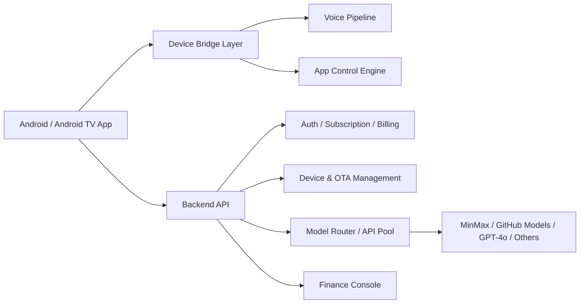

# OpenClaw Android TV Assistant Implementation Plan

> **For Claude:** REQUIRED SUB-SKILL: Use superpowers:executing-plans to implement this plan task-by-task.

**Goal:** 基于 `mithun50/openclaw-termux` 的思路，规划一套可兼容低版本 Android 与 Android TV 的 OpenClaw 安卓客户端及配套后端系统，支持本地多语言语音交互、电视应用控制、订阅计费、设备共享、虚拟形象展示、OTA 灰度发布与模型 API 池管理。

**Architecture:** 采用“客户端轻量原生能力 + 云端控制与计费中台 + 模型路由层”的三层架构。客户端优先保证旧版 Android/Android TV 设备兼容与离线可运行的基础语音链路；云端集中处理账户、订阅、设备授权、模型调度、OTA 与财务管理；模型网关负责多供应商路由、成本控制、配额与池化复用。

**Tech Stack:** Flutter（客户端 UI）、Android Kotlin 插件（系统控制/媒体会话/语音能力/OTA 集成）、NestJS 或 FastAPI（后端 API）、PostgreSQL、Redis、对象存储、消息队列、Stripe/稳定币支付适配、MinIO/S3 OTA 包分发、OpenClaw Gateway/自建 Model Router。

---

## 1. 项目目标

构建一个适用于手机、盒子、电视的一体化 AI 助手系统，核心体验是“说一句话即可控制电视上的 App 与节目播放”，并能通过订阅与充值支撑大模型成本。

首期计划不追求全量智能家居平台，而聚焦三个高价值场景：

1. 电视内 App 启停与页面唤起
2. 播放控制，如播放、暂停、快进、返回、切台、下一集
3. 多语言语音问答与大字字幕化展示

## 2. 产品范围

### 2.1 客户端能力

- 本地唤醒后的语音输入，支持英语、西班牙语、土耳其语、俄语、中文
- 大号文字输出，适配 Android TV 的 10-foot UI
- 虚拟形象展示，可选男女老少多个角色
- 通过 Android 原生能力控制本机 App 的启动、停止、前台切换
- 通过 `AccessibilityService`、`MediaSession`、`KeyEvent`、`Intent` 等能力对 App 内部播放进行控制
- 登录、订阅状态、Token 余额、设备列表查看
- 一账号多设备共享 API/密钥，带设备上限与风控

### 2.2 服务端能力

- 用户、订阅、充值、订单、设备、密钥授权管理
- 模型路由与 API 池化调度
- 设备版本管理、分批分时分区 OTA
- 财务后台，管理充值流水、Token 消耗、供应商成本
- 风控与限额控制，避免共享 API 被滥用

### 2.3 不纳入 MVP 的内容

- 复杂 3D 数字人引擎
- 完整智能家居协议接入
- 自研 ASR/TTS 大模型训练
- 完整 App 内容抓取与自动化适配所有第三方视频平台

## 3. 参考仓库可复用部分

`openclaw-termux` 可作为“安卓端运行 OpenClaw gateway 的基础容器壳”参考，但不建议直接把现有实现原封不动当做 TV 正式产品架构。其价值主要在以下几个方面：

- Flutter Android App 外壳、权限申请与前台服务模式
- Android 侧与 OpenClaw/Gateway 的集成方式
- 本地 WebSocket/Node 能力桥接思路
- 设备能力暴露到 AI Agent 的执行模型

本项目建议做两层取舍：

1. 手机调试版可以沿用较多 `openclaw-termux` 思路，便于快速验证 Agent 控制链路
2. Android TV 正式版应弱化“内建终端/Ubuntu/proot”依赖，改为“原生插件 + 轻量客户端 + 云控后端”路线，降低低版本系统兼容风险、安装体积、后台保活难度和运维复杂度

## 4. 推荐总体架构



### 4.1 客户端分层

- `Presentation Layer`
  - TV 主界面、虚拟形象、大字字幕、设备状态、会员与余额页
- `Voice Layer`
  - 本地录音、VAD、ASR 适配、TTS 播放、多语言管理
- `Control Layer`
  - App 启停、深链拉起、媒体控制、按键事件注入、Accessibility 自动化
- `Sync Layer`
  - 登录鉴权、设备注册、订阅同步、配置下发、OTA 拉取
- `Compatibility Layer`
  - 兼容 Android 7/8/9 及 Android TV 定制 ROM 的能力探测与降级

### 4.2 服务端分层

- `Identity & Device Service`
  - 账号、设备绑定、共享授权、密钥管理
- `Billing Service`
  - 订阅、充值、支付回调、账单、Token 账本
- `Model Router`
  - 统一模型调用入口、供应商路由、配额、成本与池化策略
- `OTA Service`
  - 版本管理、渠道包、灰度规则、区域与时间窗口
- `Operations Console`
  - 设备监控、策略配置、财务面板、供应商成本管理

## 5. 关键技术决策

### 决策 A: 客户端框架

- 推荐：`Flutter + Kotlin/Java 原生插件`
- 原因：Flutter 适合同时覆盖手机与 TV UI，原生插件便于接入 `AccessibilityService`、`MediaSessionManager`、`TextToSpeech`、`SpeechRecognizer`、前台服务与系统权限
- 取舍：若完全原生 Android TV 开发，兼容层更强，但跨端与 UI 迭代速度下降

### 决策 B: 语音链路

- 推荐：MVP 用“系统 ASR + 云端 ASR/TTS 兜底 + 本地 TTS”
- 兼容策略：
  - 高版本设备优先系统语音识别
  - 无 Google 服务设备使用云端 Whisper/第三方 ASR
  - 输出语音优先系统 TTS，缺失时降级到云端音频
- 原因：旧系统与海外 ROM 差异大，自研全本地 ASR 成本高，先做可运行覆盖率最重要

### 决策 C: 控制第三方 App

- 推荐：三层控制策略并存
  - 第一层：`Intent/Deep Link` 启动 App
  - 第二层：`MediaSession + KeyEvent` 做播放控制
  - 第三层：`AccessibilityService` 做页面级自动化与特殊 App 兜底
- 风险：不同 TV 厂商 ROM 与视频平台对自动化支持差异大，需要建立“适配矩阵”

### 决策 D: 模型接入

- 推荐：建立统一 `Model Router`
- 优先供应商：
  - `MinMax` 作为低成本主路由
  - `GitHub Models` 作为研发或部分免费额度来源
  - `OpenAI GPT-4o` 作为高质量兜底
- 说明：供应商可继续扩展，但客户端绝不直连模型厂商，全部经后端统一审计、计费与调度

### 决策 E: API 池化与共享

- 推荐：共享的是“平台配额与设备授权”，不是让用户直接看到上游真实密钥
- 原因：可避免密钥泄露、便于回收、风控与按设备/账号/会话限流
- 池化策略：对空闲账号配额采用租约制短时分配，不做永久转移

## 6. 非功能要求

### 性能

- 语音指令从结束说话到执行动作的目标延迟：`2.0s ~ 4.0s`
- 电视大字字幕首次出现时间：`< 800ms`
- 主界面启动时间：`< 3s`

### 兼容性

- 目标最低系统建议：`Android 7.0+`
- 必测重点：AOSP TV、Google TV、国产盒子定制 ROM、无 GMS 环境
- 遥控器优先，不依赖触摸手势

### 安全

- 设备与后端通信全程 TLS
- 密钥仅存后端，客户端使用短期访问令牌
- 支付、账务、设备授权、模型调用均保留审计日志

### 可运维性

- 支持远程配置语音策略、模型路由、开关功能
- 支持按设备组/区域/版本灰度 OTA
- 支持崩溃日志、指令日志、设备在线状态采集

## 7. MVP 定义

MVP 目标是先打通“一个账号、多台电视设备、能说能控、能收费、能升级”。

### MVP 必做

- Android/Android TV 客户端基础壳
- 多语言语音输入与 TTS 播放
- 虚拟形象静态或半动态展示
- 大字字幕输出
- 3 到 5 个重点 App 的启停控制
- 播放/暂停/快进/返回/下一集等通用控制
- 用户注册登录
- 订阅月付与充值
- 一账号多设备绑定与设备上限控制
- 后端设备管理台
- OTA 分批发布
- 模型网关与最基本的成本路由

### MVP 可延后

- 稳定币支付
- 高拟真数字人
- API 动态借用高级策略
- 多区域复杂税务与财务结算

## 8. 建议研发阶段

### Phase 0: 需求冻结与 PoC（2 周）

目标：验证“旧安卓 TV 上语音控制第三方 App”是否可行。

交付：

- 设备兼容性清单
- 目标 App 控制矩阵
- 语音方案 PoC
- `openclaw-termux` 复用边界结论

### Phase 1: 客户端 MVP 骨架（3 周）

目标：做出可安装、可登录、可展示、可收发指令的 TV 客户端。

交付：

- Flutter TV 首页
- 角色形象选择
- 大字字幕层
- 设备注册与配置拉取
- 原生桥接层框架

### Phase 2: 语音与控制闭环（4 周）

目标：打通语音输入 -> 意图解析 -> 电视控制 -> 结果播报。

交付：

- ASR/TTS 适配层
- 控制执行引擎
- 重点视频 App 控制适配
- 指令日志与失败回退

### Phase 3: 账户、订阅、充值（3 周）

目标：建立商业闭环。

交付：

- 用户账户体系
- 订阅套餐
- Token 余额与扣费逻辑
- 信用卡支付接入
- 稳定币支付预留接口

### Phase 4: 设备共享与模型池（3 周）

目标：支撑一账号多设备与低成本模型调度。

交付：

- 设备绑定与解绑
- 共享策略与风控
- 模型 Router
- API 池租约机制

### Phase 5: OTA 与运营后台（3 周）

目标：让系统可持续运营。

交付：

- 版本管理
- 灰度规则
- 分区/分时/分组发布
- 财务与供应商成本面板

### Phase 6: 稳定性与量产适配（4 周）

目标：补足低版本设备和 Android TV ROM 的稳定性。

交付：

- 兼容性修复
- 崩溃与 ANR 优化
- 启动速度优化
- 后台保活与断线重连

## 9. 建议团队配置

最小可行团队：

- 1 名产品经理/项目负责人
- 1 名 Flutter 工程师
- 1 名 Android 原生工程师
- 1 名 后端工程师
- 1 名 测试/兼容性工程师
- 0.5 名 UI/视觉设计

如果要 3 个月内压缩上线，建议至少增加 1 名后端或 1 名 Android 原生工程师。

## 10. 核心数据模型

### 主要实体

- `User`
- `SubscriptionPlan`
- `WalletAccount`
- `PaymentOrder`
- `TokenLedger`
- `Device`
- `DeviceBinding`
- `VoiceProfile`
- `AvatarProfile`
- `AppControlProfile`
- `OtaRelease`
- `ModelProvider`
- `ProviderKeyPool`
- `ModelUsageLog`
- `FinanceSettlement`

### 关键关系

- 一个 `User` 可绑定多个 `Device`
- 一个 `User` 可拥有一个或多个 `SubscriptionPlan`
- 所有 Token 消耗都要进入 `TokenLedger`
- 模型调用必须关联 `ModelProvider` 与 `ModelUsageLog`
- OTA 发布按 `Device group / region / version` 命中

## 11. 风险清单与缓解

### 风险 1: 旧版 Android TV 权限差异大

- 缓解：建立“能力探测 + 降级执行 + 白名单适配”机制

### 风险 2: 第三方视频 App 控制不稳定

- 缓解：先做少量重点 App，形成适配矩阵，不承诺全平台通吃

### 风险 3: 计费与共享可能被滥用

- 缓解：设备指纹、并发限制、租约时长、风控策略、异常扣费预警

### 风险 4: 模型供应商成本波动

- 缓解：统一路由、多供应商兜底、按任务类型切换模型档位

### 风险 5: Android TV 商店上架审核

- 缓解：Accessibility、后台服务、支付相关权限提前做合规评估；必要时区分“商店版”和“侧载增强版”

## 12. 具体任务拆分

### Task 1: 产出产品需求文档 PRD

**Files:**
- Create: `docs/product/2026-03-19-openclaw-android-tv-prd.md`
- Reference: `docs/plans/2026-03-19-openclaw-android-tv-plan.md`

**Step 1: 明确 MVP 用户旅程**

- 注册/登录
- 绑定设备
- 说话控制电视
- 查看字幕与角色播报
- 充值/订阅

**Step 2: 定义角色与权限**

- 普通用户
- 家庭共享管理员
- 运营管理员
- 财务管理员

**Step 3: 输出功能边界**

- 必做
- 可延期
- 明确不做

**Step 4: 评审并冻结**

- 与业务确认市场、区域、支付方式优先级

**Step 5: Commit**

```bash
git add docs/product/2026-03-19-openclaw-android-tv-prd.md docs/plans/2026-03-19-openclaw-android-tv-plan.md
git commit -m "docs: add android tv assistant product plan"
```

### Task 2: 客户端技术设计

**Files:**
- Create: `docs/architecture/2026-03-19-android-client-architecture.md`

**Step 1: 设计 Flutter 模块结构**

- `app_shell`
- `tv_home`
- `voice`
- `control`
- `billing`
- `device_sync`

**Step 2: 设计原生插件边界**

- `speech`
- `tts`
- `media_control`
- `accessibility_bridge`
- `ota`

**Step 3: 定义兼容策略**

- Android 版本能力表
- GMS/非 GMS 差异
- TV/手机交互差异

**Step 4: 补充时序图**

- 语音识别
- 执行动作
- 错误回退

**Step 5: Commit**

```bash
git add docs/architecture/2026-03-19-android-client-architecture.md
git commit -m "docs: add android client architecture"
```

### Task 3: 后端系统设计

**Files:**
- Create: `docs/architecture/2026-03-19-backend-architecture.md`
- Create: `docs/adr/ADR-001-model-router.md`
- Create: `docs/adr/ADR-002-device-sharing.md`
- Create: `docs/adr/ADR-003-ota-strategy.md`

**Step 1: 设计服务边界**

- 认证
- 计费
- 设备
- OTA
- 模型路由
- 财务

**Step 2: 定义数据模型**

- 数据表
- 主外键
- 审计日志

**Step 3: 定义 API**

- 鉴权
- 订阅
- 充值
- 设备注册
- OTA 拉取
- 模型调用

**Step 4: 输出 ADR**

- 为什么要模型路由
- 为什么共享配额不共享原始密钥
- 为什么 OTA 用灰度发布

**Step 5: Commit**

```bash
git add docs/architecture/2026-03-19-backend-architecture.md docs/adr/ADR-001-model-router.md docs/adr/ADR-002-device-sharing.md docs/adr/ADR-003-ota-strategy.md
git commit -m "docs: add backend architecture and adrs"
```

### Task 4: 兼容性验证计划

**Files:**
- Create: `docs/testing/2026-03-19-android-tv-compatibility-matrix.md`

**Step 1: 建设备清单**

- Android 7/8/9 电视盒子
- Google TV
- 国产定制 TV

**Step 2: 建目标 App 清单**

- 视频平台
- 音乐平台
- 系统设置

**Step 3: 设计测试用例**

- 启动
- 语音识别
- 播放控制
- 登录
- 充值
- OTA

**Step 4: 确认验收标准**

- 成功率
- 延迟
- 崩溃率

**Step 5: Commit**

```bash
git add docs/testing/2026-03-19-android-tv-compatibility-matrix.md
git commit -m "docs: add compatibility validation plan"
```

### Task 5: 商业化与运营设计

**Files:**
- Create: `docs/ops/2026-03-19-billing-and-operations-plan.md`

**Step 1: 定义套餐**

- 月订阅
- 年订阅
- Token 充值包

**Step 2: 定义共享规则**

- 最大设备数
- 并发数
- 超限策略

**Step 3: 定义运营规则**

- OTA 灰度
- 区域发布时间
- 风控规则

**Step 4: 定义财务面板指标**

- 收入
- 充值
- Token 成本
- 毛利率

**Step 5: Commit**

```bash
git add docs/ops/2026-03-19-billing-and-operations-plan.md
git commit -m "docs: add billing and operations plan"
```

## 13. 建议优先级

如果你准备正式开做，我建议严格按这个顺序推进：

1. 先做 `Phase 0` PoC，确认 3 到 5 个目标 App 控制可行
2. 再做 TV 客户端壳和语音控制闭环
3. 然后补计费与共享
4. 最后再做 API 池高级策略和财务大盘

原因很简单：真正最不确定、最容易卡死项目的，不是支付，也不是后台，而是“旧安卓 TV 上到底能不能稳定控制目标 App”。

## 14. 当前建议结论

这是一个可以做、但必须先做兼容性 PoC 的项目。最佳路线不是把 `openclaw-termux` 直接封装成 TV 成品，而是把它当作控制链路参考样板，然后重新设计一套更适合低版本 Android/Android TV 的正式架构。

如果下一步继续，我建议立刻进入两个产出：

1. `PRD`
2. `Phase 0 PoC` 的设备与目标 App 验证清单
