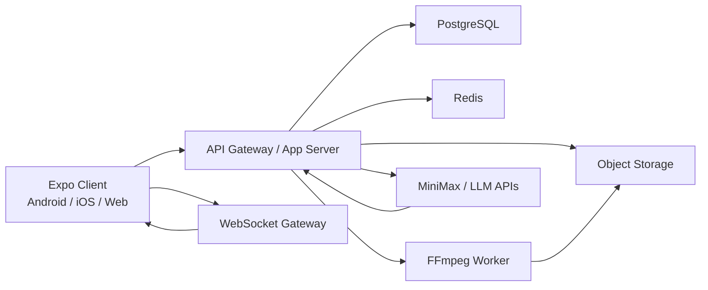

# 广播 APP 设计方案

## 1. 项目目标

做一个以语音为主交互方式的单界面广播 APP，基于一套代码运行在 Android、iOS、Web。

产品核心不是传统内容流页面，而是一个“可收听、可发声、可由 AI 参与播报”的互联网广播终端。用户可以：

- 收听互联网电台目录中的频道
- 通过按住说话发送语音广播
- 收听其他用户或 AI 生成的广播内容
- 与在线大模型进行语音对话，并将回复以广播形式播出

## 2. 范围定义

### 2.1 MVP 范围

- 单主界面
- 支持麦克风录音
- 支持发送语音广播
- 支持播放互联网电台流
- 支持播放用户广播与 AI 广播
- 支持按地区、语言、频段标签浏览电台目录
- 支持接入在线大模型，例如 MiniMax
- 支持基础广播历史

### 2.2 暂不纳入 MVP

- 真实 FM/AM/短波硬件扫频
- 射频发射
- 多人低延迟实时语音房
- 复杂社交关系系统
- 多页面内容社区

## 3. 用户体验设计

### 3.1 单界面结构

页面只保留一屏，降低操作复杂度。

1. 顶部区域
- 当前频道名称
- 地区 / 语言 / 频段标签
- 在线状态与网络状态

2. 中间主区域
- 当前播放源卡片
- 波形或简化频谱动画
- 当前广播标题
- 来源类型：电台 / 用户 / AI

3. 底部核心操作区
- 主按钮：按住说话
- 播放 / 暂停
- 切换频道
- AI 对话开关
- 广播历史入口

### 3.2 交互原则

- 语音优先，点击最少
- 单手可操作
- 正在收听与正在发声状态必须明显区分
- 网络差时优先保证播放稳定，其次保证上传成功

### 3.3 智能前台

主界面需要具备一层轻量本地智能，用于处理高频语音命令，而不是所有操作都走云端模型。

首批本地命令：

- `下一个`
- `换一个`
- `听歌`
- `听新闻`
- `以后不听这个`

本地策略：

- 优先按用户所在地区推荐附近频道
- 结合历史收听时长提升熟悉频道权重
- 对“以后不听这个”的频道降权或拉黑
- 云端大模型负责复杂问答，本地命令负责快速控制

## 4. 推荐技术方案

## 4.1 客户端

- React Native
- Expo
- TypeScript
- Zustand
- Expo Router 或单入口轻路由
- `expo-audio` 负责录音与播放
- `axios` + `WebSocket` 负责 API 与广播推送
- `@react-native-async-storage/async-storage` 负责本地缓存

说明：
参考项目 `JKVideo` 的价值主要在跨端组织方式、状态管理、services/store/utils 分层，以及 Expo 项目工程化；视频播放、弹幕、DASH 等能力不应直接迁移。

## 4.2 服务端

- Node.js
- NestJS 优先
- PostgreSQL
- Redis
- 对象存储（S3 兼容）
- WebSocket 网关
- FFmpeg 音频处理链

## 4.3 为什么推荐 PTT 模式

第一版采用“按住说话，松开发送”的半实时广播模式，而不是全双工实时语音房。

原因：

- Expo 跨 Android / iOS / Web 更稳
- 音频权限、焦点切换、网页麦克风兼容更容易控制
- 服务端链路更简单，便于插入 ASR、LLM、TTS
- 更像“广播投稿”而不是“多人会议”

## 5. 高层架构



## 6. 核心模块设计

### 6.1 电台目录模块

职责：

- 提供地区、国家、语言、频段标签筛选
- 提供频道详情
- 提供流地址与可用性状态

说明：

- “频段”在 MVP 中作为目录标签，例如 `FM 90.5`、`AM 1017`
- 实际播放源是互联网流地址，而不是本机直接接收射频信号

### 6.2 音频录制模块

职责：

- 请求麦克风权限
- 启动录音
- 停止录音
- 生成本地音频文件
- 上传前本地试听

客户端要求：

- iOS 支持静音模式下录制/播放策略
- Android 处理音频焦点
- Web 处理浏览器权限与录音格式兼容

### 6.3 广播发送模块

职责：

- 上传音频文件
- 写入广播消息记录
- 触发转码
- 生成统一播放格式
- 通过 WebSocket 广播消息状态

建议格式：

- 上传原始文件允许 `m4a/webm/wav`
- 服务端统一转码输出 `aac` 或 `mp3`

### 6.4 广播播放模块

职责：

- 播放互联网电台流
- 播放用户广播
- 播放 AI 播报
- 维护单一全局播放器状态

状态切换规则：

- 同一时刻只保留一个主播放源
- 用户主动发声时，可暂停当前电台
- 广播结束后可恢复原频道播放

### 6.5 AI 对话模块

链路建议：

1. 用户录音上传
2. 服务端调用 ASR 转文字
3. 将文本送入 MiniMax
4. 获取文本回复
5. 调用 TTS 生成播报音频
6. 推送可播放广播消息

第一版建议服务端代理所有大模型请求，不让客户端直连模型供应商。

好处：

- API Key 不暴露
- 便于统一鉴权、限流、缓存、审计
- 后续可切换 MiniMax / OpenAI / 其他模型而不改客户端协议

## 7. 数据模型

### 7.1 stations

- `id`
- `name`
- `country`
- `region`
- `city`
- `language`
- `band_label`
- `genre`
- `stream_url`
- `homepage_url`
- `logo_url`
- `source_type`
- `is_active`
- `last_checked_at`

### 7.2 broadcasts

- `id`
- `station_id`
- `user_id`
- `source_kind`：`user` / `ai` / `system`
- `text_transcript`
- `audio_url`
- `duration_ms`
- `status`
- `created_at`

### 7.3 ai_sessions

- `id`
- `user_id`
- `model_provider`
- `model_name`
- `session_state`
- `last_message_at`

### 7.4 users

- `id`
- `nickname`
- `avatar_url`
- `created_at`

## 8. API 设计草案

### 8.1 电台目录

- `GET /stations`
- `GET /stations/:id`
- `GET /stations/filters`

### 8.2 广播

- `POST /broadcasts/upload`
- `POST /broadcasts`
- `GET /broadcasts`
- `GET /broadcasts/:id`

### 8.3 AI

- `POST /ai/chat`
- `POST /ai/voice-chat`

### 8.4 实时推送

WebSocket 事件建议：

- `broadcast.created`
- `broadcast.updated`
- `broadcast.ready`
- `player.interrupt`
- `station.status.changed`

## 9. 客户端目录建议

```text
apps/radio-app/
  app/
    index.tsx
  src/
    components/
      audio/
      station/
      broadcast/
      common/
    features/
      stations/
      recorder/
      player/
      ai/
      broadcasts/
    services/
      api/
      ws/
      audio/
      minimax/
    store/
      playerStore.ts
      recorderStore.ts
      stationStore.ts
      sessionStore.ts
    hooks/
    utils/
    constants/
    types/
  assets/
  app.json
  package.json
```

说明：

- `playerStore` 管全局唯一播放器
- `recorderStore` 管录音状态与上传状态
- `stationStore` 管目录与当前频道
- `sessionStore` 管用户与 AI 会话

## 10. 关键架构决策

### ADR-001：单界面优先

决策：
采用单界面主交互，避免传统多 Tab 内容型结构。

理由：

- 更符合广播设备感
- 更适合语音优先
- 降低跨端 UI 成本

代价：

- 信息密度受限
- 扩展功能时需要更谨慎地控制入口

### ADR-002：MVP 采用 PTT 而不是实时语音房

决策：
按住说话，松开发送。

理由：

- 跨端实现成本更低
- 稳定性更高
- 更适合广播投稿和 AI 中转

代价：

- 实时互动感弱于 WebRTC 对讲

### ADR-003：客户端不直连大模型

决策：
全部模型请求由后端代理。

理由：

- 安全
- 可观测
- 易替换供应商

代价：

- 服务端链路更重

### 6.6 本地命令理解模块

职责：

- 接收本地 ASR 结果文本
- 解析轻量控制意图
- 调用频道推荐器完成换台

建议实现：

- 本地规则引擎优先
- 跨端 ASR 能力通过适配层接入
- 无法识别时再回退到云端模型理解

## 11. 广播目录来源建议

优先使用公开互联网电台目录或可授权源，后台定期清洗：

- 电台名称
- 地区
- 语言
- 频段标签
- 流地址可用性
- 封面与官网

需要注意：

- 不同地区的流地址版权与分发限制不同
- 某些台仅允许官网内嵌，不允许第三方 App 聚合
- 因此 `stations` 必须保留 `legal_notes` 或扩展合规字段

## 12. 风险与应对

### 12.1 流地址失效

风险：
互联网电台流常失效或频繁切换。

应对：

- 定时健康检查
- 维护多候选流
- 客户端快速切换备用源

### 12.2 Web 端录音兼容

风险：
不同浏览器编码格式不一致。

应对：

- Web 上传时允许 `webm`
- 服务端统一转码

### 12.3 音频焦点与后台播放

风险：
iOS / Android 的系统行为差异明显。

应对：

- 第一版先保证前台稳定
- 第二版再增强后台播放与锁屏控制

### 12.4 模型费用与响应延迟

风险：
AI 语音链路成本高，首包延迟不稳定。

应对：

- 文本与语音接口分级
- 增加缓存
- 对长回复做分段播报

## 13. 开发阶段建议

### Phase 0：技术验证

- Expo 音频录制与播放打通
- Web 麦克风权限打通
- 播放 1 个互联网电台流
- 完成服务端音频上传与转码

### Phase 1：MVP

- 单界面完成
- 电台目录完成
- PTT 广播完成
- 广播历史完成
- MiniMax 语音对话完成

### Phase 2：增强

- 收藏频道
- 频道推荐
- AI 主播人格
- 多地区专题广播流

### Phase 3：进阶

- 更低延迟的流式语音交互
- 多用户频道协作
- 后台播放优化
- 锁屏卡片与媒体控制

## 14. 从 JKVideo 借鉴的实施建议

可借鉴：

- Expo 跨端项目结构
- Zustand 状态组织
- `services`、`store`、`utils` 分层
- 工程配置和跨平台打包经验

不建议直接复用：

- 视频播放器方案
- DASH 相关能力
- 弹幕链路
- 针对视频内容流设计的页面结构

## 15. 推荐下一步

如果进入实施阶段，建议先完成以下最小切片：

1. 初始化 `apps/radio-app` Expo 工程
2. 搭建单界面骨架
3. 接入 `expo-audio` 录音与播放
4. 接 1 个测试电台流
5. 搭一个最小 Node 服务用于上传音频并回放
6. 接入 MiniMax 文本对话，再补 TTS

这条路径能最快验证“广播感 + 语音交互 + AI 播报”是否成立。
